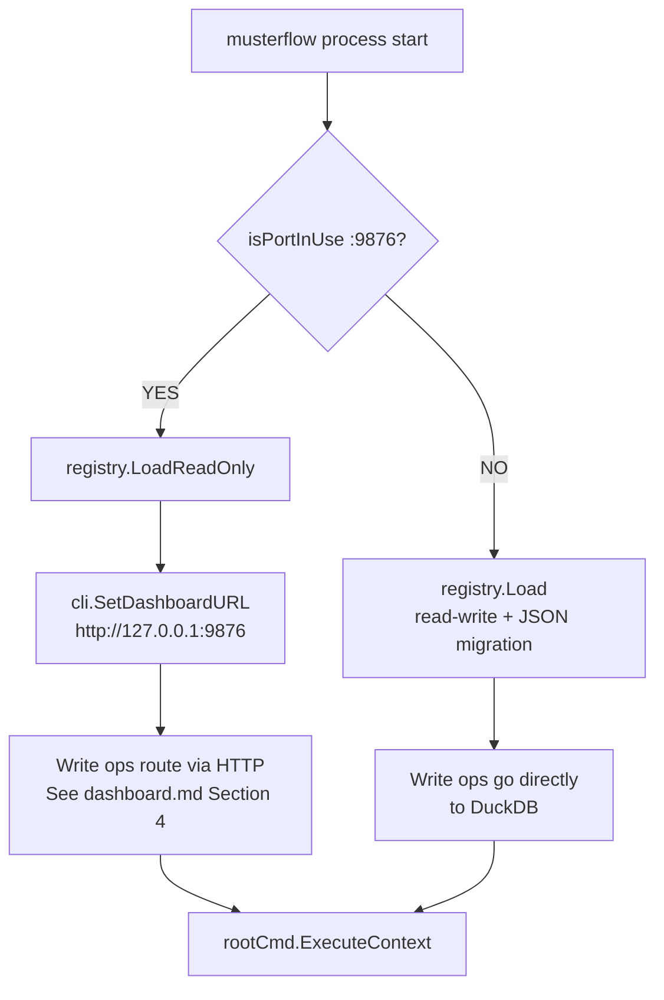
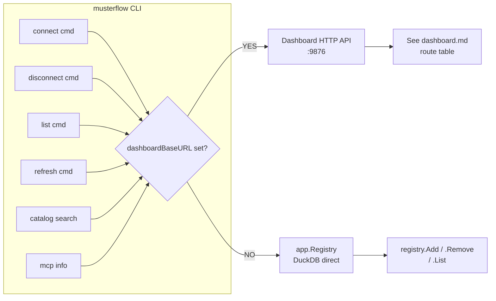

# SPEC-047a — CLI Command Tree

**Status:** Active
**Task:** SPEC-047
**Date:** 2026-07-20
**References:** specs/dashboard.md (CLI-Dashboard routing), AGENTS.md, README.md
**Module:** `github.com/totalwindupflightsystems/musterflow`
**Package:** `internal/cli`

---

## 1. Purpose

The CLI package (`internal/cli`) defines the complete Cobra command tree for `musterflow`: 17 top-level subcommands plus lazily-generated per-API subcommands, with write-operation routing through the dashboard HTTP API when the dashboard is already running.

---

## 2. Interface

All public functions and types in `internal/cli`. A worker copies these signatures exactly.

### 2.1 Root Command

```go
// NewRootCommand creates the root musterflow command with all 14 static subcommands
// pre-registered, then calls loadAPISubcommands to add one subcommand per connected API.
func NewRootCommand(registry *app.Registry) *cobra.Command
```

**Root command properties:**
- `Use`: `"musterflow"`
- `Short`: `"Turn any API into a CLI, an MCP tool, and a workflow"`
- Persistent flags (set by `main.go`, not by `NewRootCommand`):
  - `--dashboard-addr string` — Dashboard HTTP address (default: port from config)
  - `--data-dir string` — Data directory (default: `~/.musterflow`)
  - `--output, -o string` — Output file path (format auto-detected from extension). Set via `root.PersistentFlags().StringVarP(&outputFlag, "output", "o", "", ...)`.
- Default `RunE` (set by `main.go`): `cmd.Help()` — root with no args prints help.

### 2.2 Subcommand Registration

`NewRootCommand` calls `root.AddCommand(...)` for each of these 14 static subcommand constructors (all unexported, taking `*app.Registry` unless noted):

| # | Constructor | Use | Args | Notes |
|---|-------------|-----|------|-------|
| 1 | `newStartCommand(registry)` | `start` | none | Overridden in `main.go` to call `startServer`. |
| 2 | `newConnectCommand(registry)` | `connect <spec-url>` | `ExactArgs(1)` | Flags: `--base-url, -u`, `--name, -n`, `--auth` |
| 3 | `newListCommand(registry)` | `list` | none | |
| 4 | `newDisconnectCommand(registry)` | `disconnect <api-id>` | `ExactArgs(1)` | |
| 5 | `newCatalogCommand(registry)` | `catalog` | — | Parent; subcommands: `search`, `push`, `pull` |
| 6 | `newFlowCommand(registry)` | `flow` | — | Parent; subcommands: `create`, `list`, `run` |
| 7 | `newMCPCommand(registry)` | `mcp` | none | |
| 8 | `newConfigCommand(registry)` | `config` | — | Parent; subcommands: `show`, `set <key> <value>` |
| 9 | `newAuthCommand(registry)` | `auth` | — | Parent; subcommands: `add`, `list`, `remove`, `get`, `login` |
| 10 | `newCompletionCommand()` | `completion [bash\|zsh\|fish]` | `ExactArgs(1)` | No registry arg. |
| 11 | `newExportCommand(registry)` | `export [path]` | `MaximumNArgs(1)` | Flag: `--output, -o` |
| 12 | `newImportCommand(registry)` | `import <path>` | `ExactArgs(1)` | |
| 13 | `newRefreshCommand(registry)` | `refresh <api-id>` | `ExactArgs(1)` | |
| 14 | `newTransformCommand()` | `transform` | — | Parent; subcommands: `list`, `install` |

After the 14 static subcommands, `loadAPISubcommands(root, registry)` adds one dynamically-generated subcommand per connected API (Section 2.6).

**Total top-level commands visible via `musterflow --help`:** 14 static + N per-API = 14 + N. Cobra's built-in `help` command is added automatically (15th implicit). README lists 17 including `help` and the implicit `--help` flag behavior; the 14 registered constructors plus cobra's auto-help and the API subcommand group account for the full set.

### 2.3 ExecuteOptions and BuildRequest

```go
// ExecuteOptions configures an API call from CLI flags.
type ExecuteOptions struct {
	Method      string            // HTTP method: GET, POST, PUT, PATCH, DELETE, HEAD, OPTIONS
	BaseURL     string            // Fully-resolved base URL (scheme + host)
	Path        string            // Path template, e.g. "/users/{id}"
	PathParams  map[string]string // param name → cobra flag name (for path params)
	QueryFlags  map[string]string // cobra flag name → param name (for query params)
	BodyFlags   map[string]string // cobra flag name → JSON body property name
	Format      string            // "table", "json", "yaml", "csv", "jsonl", "parquet"
	Raw         bool              // if true, output raw response body without formatting
	AuthToken   string            // explicit bearer token (overrides auto-resolved auth)
	Output      string            // output file path; format auto-detected from extension
	AuthManager *auth.Manager     // auth manager for auto-resolving credentials (falls back to global authMgr)
	APIID       string            // API ID for credential lookup
}

// BuildRequest constructs a *request.Builder from ExecuteOptions and cobra command flags.
// It reads path params, query params, and body flags from the cobra command,
// auto-resolves auth from the auth manager (or global authMgr) if no explicit token,
// and returns a ready-to-execute request builder.
func BuildRequest(cmd *cobra.Command, opts ExecuteOptions) (*request.Builder, error)

// ExecuteAndFormat executes the request and formats the output.
// Format resolution order: opts.Format > opts.Output extension > "table".
// Output destination: opts.Output file path > cmd.OutOrStdout().
// Returns error if HTTP status >= 400 or if formatting fails.
func ExecuteAndFormat(cmd *cobra.Command, builder *request.Builder, opts ExecuteOptions) error
```

### 2.4 Global State Setters (called by main.go)

```go
// SetAuthManager sets the global auth manager for auto-injecting credentials.
// Called by main.go after loading config. Used by BuildRequest when opts.AuthManager is nil.
func SetAuthManager(m *auth.Manager)

// SetDashboardURL sets the dashboard base URL so CLI write operations route
// through the dashboard HTTP API (avoiding DuckDB lock conflicts).
// When non-empty, connect/disconnect/list/refresh/catalog/mcp route via HTTP.
func SetDashboardURL(url string)
```

### 2.5 Dashboard-Routing Helper Functions (unexported)

These are called by subcommand `RunE` functions when `dashboardBaseURL != ""`:

```go
func connectViaDashboard(specURL, baseURL, nameInput, authType string) error    // POST /api/apis
func disconnectViaDashboard(apiID string) error                                  // DELETE /api/apis/<id>
func listViaDashboard() error                                                   // GET /api/apis
func catalogSearchViaDashboard(query string) error                              // GET /api/catalog/search?q=<query>
func refreshViaDashboard(apiID string) error                                   // POST /api/apis/<id>/refresh
func pushViaDashboard(apiID string) error                                      // GET /api/apis/<id> → print catalog entry JSON
func pullViaDashboard(apiID string) error                                      // catalog.FetchEntry → POST /api/apis
func mcpViaDashboard() error                                                   // GET /api/mcp/info
```

### 2.6 Per-API Subcommand Generation

```go
// loadAPISubcommands iterates registry.List() and adds one cobra command per connected API.
// Each API subcommand has DisableFlagParsing=true and lazily generates its operation
// subcommands on first access via sync.Once (ensureAPILoaded → loadAPICommands).
func loadAPISubcommands(root *cobra.Command, registry *app.Registry)

// createAPISubcommand creates the parent cobra command for a single connected API.
// Sets Use=conn.Name, Short, Long=conn.Description, DisableFlagParsing=true.
// PersistentPreRunE and help func both trigger ensureAPILoaded.
func createAPISubcommand(conn *app.APIConnection) *cobra.Command

// ensureAPILoaded lazily generates cobra commands for a connected API on first access.
// Uses a package-level map[string]*apiCommandState guarded by apiCommandsMu.
// Safe to call from multiple paths (PersistentPreRunE, help func, ValidArgsFunction).
func ensureAPILoaded(cmd *cobra.Command, conn *app.APIConnection) error

// loadAPICommands fetches and parses the OpenAPI spec, clears per-operation server URLs,
// generates cobra commands via muster's generator.Generator, and adds them to the parent.
func loadAPICommands(parent *cobra.Command, conn *app.APIConnection) error
```

### 2.7 Auth Command Flags (package-level vars)

```go
var (
	typeFlag        string // --type (default "bearer"): none, apikey, bearer, oauth2, mtls
	keyFlag         string // --key: API key or bearer token
	certFlag        string // --cert: mTLS client certificate path
	keyPathFlag     string // --key-path: mTLS client key path
	oauthClientID     string  // --client-id: OAuth2 client ID
	oauthClientSecret string  // --client-secret: OAuth2 client secret
	oauthAuthURL      string  // --auth-url: OAuth2 authorization URL
	oauthTokenURL     string  // --token-url: OAuth2 token URL
	oauthScopes       []string // --scopes: OAuth2 scopes (comma-separated)
	oauthRedirectPort int     // --redirect-port (default 19876): local callback server port
)
```

### 2.8 Spec Loading Helpers (unexported)

```go
// loadSpecData loads OpenAPI spec data from an http(s) URL or local file path.
func loadSpecData(specURL string) ([]byte, error)

// startCallbackServer starts an HTTP server on the given port, waits for a single
// OAuth2 callback (5-minute timeout), and returns the authorization code.
func startCallbackServer(port int) (string, error)
```

---

## 3. Data Model

### 3.1 ExecuteOptions (exact struct from internal/cli/execute.go:19-33)

```go
type ExecuteOptions struct {
	Method     string
	BaseURL    string
	Path       string
	PathParams map[string]string // param name → value from positional args
	QueryFlags map[string]string // flag name → param name for query params
	BodyFlags  map[string]string // flag name → body property name
	Format     string            // "table", "json", "yaml", "csv", "jsonl", "parquet"
	Raw        bool              // output raw response
	AuthToken  string            // optional bearer token (explicit override)
	Output     string            // output file path (auto-detects format from extension)
	// Auto-resolved auth
	AuthManager *auth.Manager // auth manager for auto-resolving credentials
	APIID       string        // API ID for credential lookup
}
```

### 3.2 apiCommandState (lazy command generation)

```go
type apiCommandState struct {
	once sync.Once
	err  error
}
```

Package-level state:

```go
var apiCommands = make(map[string]*apiCommandState)
var apiCommandsMu sync.Mutex
var authMgr *auth.Manager              // set by SetAuthManager
var dashboardBaseURL string            // set by SetDashboardURL
var outputFlag string                   // set by root.PersistentFlags --output
```

### 3.3 Referenced Types (from other packages — documented for interface completeness)

**app.APIConnection** (`internal/app/registry.go:14-25`):

```go
type APIConnection struct {
	ID            string    `json:"id"`
	Name          string    `json:"name"`
	SpecURL       string    `json:"spec_url"`
	BaseURL       string    `json:"base_url"`
	Version       string    `json:"version"`
	Description   string    `json:"description"`
	AuthType      string    `json:"auth_type"` // "none", "apikey", "oauth2", "bearer", "mtls"
	AddedAt       time.Time `json:"added_at"`
	UpdatedAt     time.Time `json:"updated_at"`
	EndpointCount int       `json:"endpoint_count"`
}
```

**app.ConnectOptions / ConnectResult** (`internal/app/connect.go:27-24`):

```go
type ConnectOptions struct {
	SpecURL  string // file path or http(s) URL
	BaseURL  string // override base URL from spec
	Name     string // human-readable name (auto-detected if empty)
	AuthType string // "none", "apikey", "bearer", "oauth2", "mtls"
}

type ConnectResult struct {
	Connection    *APIConnection
	EndpointCount int
	SpecVersion   string
	SpecTitle     string
}
```

**app.RefreshResult** (`internal/app/refresh.go:66-73`):

```go
type RefreshResult struct {
	Connection     *APIConnection
	OldVersion     string
	NewVersion     string
	OldEndpoints   int
	NewEndpoints   int
	VersionChanged bool
}
```

**auth.Manager / Credential** (`internal/auth`):

```go
type Manager struct {
	cfg config.Config
}

type CredentialType string

const (
	CredentialNone   CredentialType = "none"
	CredentialAPIKey CredentialType = "apikey"
	CredentialBearer CredentialType = "bearer"
	CredentialOAuth2 CredentialType = "oauth2"
	CredentialMTLS   CredentialType = "mtls"
)

type Credential struct {
	Type     CredentialType `json:"type"`
	Key      string         `json:"key,omitempty"`
	CertPath string         `json:"cert_path,omitempty"`
	KeyPath  string         `json:"key_path,omitempty"`
}
```

**config.Config** (`internal/config/config.go:15-21`):

```go
type Config struct {
	Port           int               `yaml:"port"`
	DataDir        string            `yaml:"data_dir"`
	DefaultFormat  string            `yaml:"default_format"`
	AutoCompletion bool              `yaml:"auto_completion"`
	Auth           map[string]AuthConfig `yaml:"auth,omitempty"`
}
```

---

## 4. Wiring

### 4.1 main.go Integration

`cmd/musterflow/main.go` wires the CLI as follows:

1. `config.Load()` → `cfg`
2. CLI flag overrides: `--data-dir` overrides `cfg.DataDir`
3. Dashboard detection: `isPortInUse("127.0.0.1:<cfg.Port>")` → if running:
   - `registry.LoadReadOnly()` (skip JSON migration — it's a write operation)
   - `cli.SetDashboardURL("http://127.0.0.1:<cfg.Port>")` → routes write ops through HTTP API
4. If dashboard NOT running: `registry.Load()` (read-write, runs JSON→DuckDB migration)
5. `auth.NewManager(cfg)` → `cli.SetAuthManager(authMgr)` — enables auto-auth injection
6. `cli.NewRootCommand(registry)` → `rootCmd`
7. `rootCmd.PersistentFlags().StringVar(&flagDashboardAddr, "dashboard-addr", "", ...)`
8. `rootCmd.PersistentFlags().StringVar(&flagDataDir, "data-dir", "", ...)`
9. Override `start` command's `RunE` to call `startServer(registry, cfg)`
10. Set root `RunE` to `cmd.Help()` (default: show help)
11. Auto-install shell completions if `completion.ShouldPrompt(cfg.AutoCompletion) && isTerminal()`
12. `rootCmd.ExecuteContext(ctx)` — ctx cancelled on SIGINT/SIGTERM

### 4.2 CLI Flags → Handlers

| Command | Flags | Handler |
|---------|-------|---------|
| `connect` | `--base-url/-u`, `--name/-n`, `--auth` | `app.Connect(ctx, registry, ConnectOptions{...})` or `connectViaDashboard(...)` |
| `disconnect` | (positional `<api-id>`) | `app.Disconnect(registry, id)` or `disconnectViaDashboard(id)` |
| `list` | none | `registry.List()` or `listViaDashboard()` |
| `refresh` | (positional `<api-id>`) | `app.Refresh(ctx, registry, id)` or `refreshViaDashboard(id)` |
| `mcp` | none | `registry.List()` print or `mcpViaDashboard()` |
| `catalog search` | (positional `<query>`) | `catalog.NewClient().Search(query)` or `catalogSearchViaDashboard(query)` |
| `catalog push` | (positional `<api-id>`) | `registry.Get(id)` → `catalog.ConnectionToCatalogEntry(conn)` → print JSON |
| `catalog pull` | (positional `<api-id>`) | `catalog.NewClient().FetchEntry(id)` → `app.Connect(ctx, registry, ...)` |
| `flow create` | `--webhook`, `--description` | `workflow.NewEngine(dir, baseURL).Create(name, template, webhook)` |
| `flow list` | none | `workflow.NewEngine(dir, baseURL).List()` |
| `flow run` | (positional `<name>`) | `workflow.NewEngine(dir, baseURL).Run(name, nil)` |
| `config show` | none | `config.Load()` → print, mask auth keys with `config.MaskKey` |
| `config set` | (positional `<key> <value>`) | `config.Load()` → update → `config.Save(cfg)` |
| `auth add` | `--type`, `--key`, `--cert`, `--key-path` | `auth.NewManager(cfg).Add(apiID, cred)` |
| `auth list` | none | `auth.NewManager(cfg).List()` → print masked |
| `auth remove` | (positional `<api-id>`) | `auth.NewManager(cfg).Remove(apiID)` |
| `auth get` | (positional `<api-id>`) | `auth.NewManager(cfg).Get(apiID)` → print raw key |
| `auth login` | `--client-id`, `--client-secret`, `--auth-url`, `--token-url`, `--scopes`, `--redirect-port` | `auth.StartLogin(cfg)` → `startCallbackServer(port)` → `auth.CompleteLogin(...)` → `mgr.Add(apiID, cred)` |
| `completion` | (positional `bash\|zsh\|fish`) | `cmd.Root().GenBashCompletionV2/GenZshCompletion/GenFishCompletion` |
| `export` | `--output/-o`, (positional `[path]`) | `app.ExportJSONL(store, path)` |
| `import` | (positional `<path>`) | `app.ImportJSONL(store, path)` |
| `transform list` | none | `wasm.NewRegistry(dir).List()` |
| `transform install` | (positional `<catalog-entry>`) | `wasm.NewRegistry(dir).InstallFromCatalog(entry)` |
| Per-API `<name> <operation>` | dynamic (from OpenAPI spec) | `BuildRequest(cmd, ExecuteOptions{...})` → `ExecuteAndFormat(cmd, builder, opts)` |

### 4.3 Config Env Vars / File

Config file: `~/.musterflow/config.yaml` (path from `config.ConfigPath()`).

```yaml
port: 9876                  # dashboard/MCP port
data_dir: ~/.musterflow/    # DuckDB + flows + transforms + config
default_format: table       # default output format for API calls
auto_completion: true        # auto-install shell completions on first interactive run
auth:                       # per-API credentials (keys stored in plaintext, masked in display)
  <api-id>:
    type: bearer
    key: <secret>
    cert: <path>             # mTLS only
    key_path: <path>         # mTLS only
```

No environment variable overrides exist — all config is via YAML file or CLI flags.

### 4.4 CLI-Dashboard Routing





```mermaid
flowchart TD
    L[Per-API subcommand<br/>DisableFlagParsing=true] --> M[PersistentPreRunE]
    L --> N[help func]
    L --> O[ValidArgsFunction]
    M --> P[ensureAPILoaded]
    N --> P
    O --> P
    P --> Q{apiCommands[connID]<br/>once.Do}
    Q --> R[loadAPICommands]
    R --> S[fetch + parse spec]
    S --> T[generator.GenerateCommands]
    T --> U[Add operation subcommands<br/>to parent cmd]
```

When `dashboardBaseURL != ""`, these commands route through the dashboard HTTP API (see `specs/dashboard.md` Section 4 for route definitions):

| CLI Command | HTTP Method + Route |
|-------------|-------------------|
| `connect` | `POST /api/apis` with JSON body `{spec_url, base_url, name, auth_type}` |
| `disconnect <id>` | `DELETE /api/apis/<id>` |
| `list` | `GET /api/apis` |
| `refresh <id>` | `POST /api/apis/<id>/refresh` |
| `catalog search <q>` | `GET /api/catalog/search?q=<q>` |
| `catalog push <id>` | `GET /api/apis/<id>` → print catalog entry JSON |
| `catalog pull <id>` | `catalog.FetchEntry(id)` → `POST /api/apis` |
| `mcp` | `GET /api/mcp/info` |

---

## 5. Error Catalog

| Condition | When it triggers | CLI Exit Code | Error Message Pattern |
|-----------|-----------------|---------------|----------------------|
| Missing positional arg | `connect`, `disconnect`, `refresh`, `auth add`, `auth remove`, `auth get`, `auth login`, `import`, `completion`, `transform install` called without required args | 1 (cobra prints arg error to stderr) | `"accepts X arg(s), received Y"` |
| Unknown config key | `config set <invalid-key> <val>` | 1 | `"unknown config key: %s (valid: port, default_format, auto_completion, data_dir)"` |
| Missing OAuth2 flags | `auth login` without `--client-id`, `--client-secret`, `--auth-url`, or `--token-url` | 1 | `"--client-id is required for OAuth2 login"` (and similar for each missing flag) |
| Spec fetch failure | `connect` with unreachable URL or missing file | 1 | `"fetch spec: %w"` wrapping `http get: ...` or file read error |
| Spec parse failure | `connect` with invalid OpenAPI document | 1 | `"parse spec: %w"` |
| Registry not loaded | Any command using `registry.Store()` when `store == nil` | 1 | `"registry not loaded"` |
| API not found | `disconnect <bad-id>`, `refresh <bad-id>`, `auth get <bad-id>` | 1 | `"api %q not found"` or `"no auth configured for %q"` |
| Unsupported shell | `completion powershell` | 1 | `"unsupported shell: %s (supported: bash, zsh, fish)"` |
| Dashboard HTTP failure | Dashboard-routing mode, dashboard unreachable or returns non-2xx | 1 | `"dashboard connect request: %w"` or `"connect via dashboard: %s"` |
| HTTP error from API call | `ExecuteAndFormat` receives HTTP >= 400 | 1 | `"HTTP %s"` (e.g. `"HTTP 404 Not Found"`) |
| Output file creation error | `--output <path>` with unwritable path | 1 | `"create output file: %w"` |
| Body marshal error | `BuildRequest` fails to marshal JSON body from flags | 1 | `"marshal body: %w"` |
| Parquet format error | `--format parquet` with data that can't be columnar-encoded | 1 | `"format Parquet: %w — try --format json instead"` |
| OAuth2 callback timeout | `startCallbackServer` waits 5 minutes with no callback | 1 | `"timed out waiting for authorization (5 minutes)"` |
| OAuth2 authorization error | Callback receives `error` query param | 1 | `"authorization error: %s (%s)"` |
| Spec load failure (lazy) | Per-API subcommand accessed, spec URL unreachable | 1 | `"load spec: %w"` |

---

## 6. Edge Cases

1. **Empty registry**: `list` prints `"No APIs connected."` and a hint. `mcp` prints `"No APIs connected. Connect APIs to expose them as MCP tools."`. `start` prints `Connected APIs: 0`. No error returned.

2. **Dashboard running, registry empty**: `listViaDashboard()` fetches `GET /api/apis`, gets `{"apis":[]}`, prints the empty message. No error.

3. **Nil body in POST /api/apis**: `handleAPIs` in dashboard checks `r.Body == nil || r.ContentLength == 0` → returns 405 Method Not Allowed. CLI `connectViaDashboard` always sends a JSON body, so this path is for direct HTTP clients.

4. **Duplicate API ID**: `generateID(specURL)` is `sha256(specURL)[:8]` — connecting the same spec URL twice produces the same ID. DuckDB `INSERT OR REPLACE` overwrites. CLI prints success both times. No error for duplicates.

5. **Base URL derivation**: If `--base-url` is empty and spec has no servers, `BaseURL` stays empty. If spec has servers, first server URL is used. Path-only server URLs like `"/api/v3"` are resolved against the spec URL's origin (scheme + host).

6. **Name derivation**: If `--name` is empty, `deriveName` uses `doc.Info.Title` (lowercased, hyphenated) or falls back to the spec URL hostname (dots → hyphens) or filename (without extension).

7. **Concurrent API subcommand generation**: `apiCommandsMu` mutex guards the `apiCommands` map; `sync.Once` in `apiCommandState` ensures `loadAPICommands` runs exactly once per API ID even if `PersistentPreRunE`, help func, and `ValidArgsFunction` race.

8. **Large response payloads**: `ExecuteAndFormat` reads the entire response body into memory via `io.ReadAll`. No streaming. Table formatter truncates cell values to 80 chars (`formatValue`).

9. **Non-JSON API response**: `ExecuteAndFormat` attempts `json.Unmarshal`; on failure, prints raw body. If HTTP status >= 400, returns error after printing.

10. **Raw mode**: `opts.Raw == true` or empty body → prints raw bytes, skips formatting. Still returns error if HTTP >= 400.

11. **Format auto-detection**: `--output data.csv` → `DetectFormat` returns `"csv"`. `--output data.jsonl` → `"jsonl"`. Unknown extension → falls back to `"table"`.

12. **YAML format**: Currently falls back to JSON (`json.MarshalIndent`) — the code comment says "yaml formatting will come later" but this is the current behavior. A worker must not add a YAML serializer without an explicit task.

13. **Auth auto-resolution**: `BuildRequest` checks `opts.AuthToken == "" && opts.APIID != ""`, then tries `opts.AuthManager` → global `authMgr`. If `mgr.Get(apiID)` fails or `cred.IsConfigured()` is false, no auth header is added. Explicit `AuthToken` always takes precedence.

14. **OAuth2 callback server port conflict**: `startCallbackServer` binds `:<port>`. If port is occupied, `ListenAndServe` errors in the goroutine; the `select` waits 5 minutes then times out. No retry.

15. **Completion in non-interactive mode**: `isTerminal()` uses `term.IsTerminal(os.Stdin.Fd())`. In cron/pipe/non-TTY contexts, returns false → completion prompt is skipped entirely.

---

## 7. Testing

Test file: `internal/cli/cli_test.go` (2277 lines), `internal/cli/integration_test.go`, `internal/cli/formats_test.go`.

Test conventions (from existing tests):
- Registry setup: `r := app.NewRegistry(t.TempDir()); if err := r.Load(); err != nil { t.Fatalf("Load: %v", err) }`
- Root command: `root := NewRootCommand(r)` then `root.SetArgs([]string{...})`
- Stdout capture: `captureStdout(func() { root.Execute() })` helper
- HTTP mocking: `httptest.NewServer(http.HandlerFunc(func(w, r) { ... }))`
- No subprocess tests — all tests run in-process via cobra's `Execute()`.

### Required Test Scenarios

| Test Name | Setup | Action | Expected |
|-----------|-------|--------|----------|
| `TestNewRootCommand_TopLevelCommands` | Empty registry, `NewRootCommand(r)` | Enumerate `root.Commands()` | Contains all 14 static subcommands: start, connect, list, disconnect, catalog, flow, mcp, config, auth, completion, export, import, refresh, transform |
| `TestRootCommand_Use` | Empty registry | Check `root.Use` | `"musterflow"` |
| `TestListCommand_Empty` | Empty registry, `root.SetArgs(["list"])` | Execute, capture stdout | Output contains `"No APIs connected"` |
| `TestListCommand_WithAPIs` | Registry with 1 API (ID="abc123", Name="github", SpecURL, BaseURL, AuthType="bearer", EndpointCount=5), `root.SetArgs(["list"])` | Execute, capture stdout | Output contains: `"Connected APIs"`, `"github"`, `"abc123"`, `"https://api.github.com"`, `"bearer"`, `"5"` |
| `TestConnectCommand_FlagParsing` | Empty registry, find `connect` command | Check `cmd.Flags()` | `--base-url`, `--name`, `--auth` flags exist |
| `TestStartCommand` | Empty registry, `root.SetArgs(["start"])` | Execute, capture stdout | Output contains `"Dashboard: http://localhost:9876"` and `"MCP endpoint: http://localhost:9876/mcp"` |
| `TestStartCommand_WithConnectedAPIs` | Registry with 1 API, `root.SetArgs(["start"])` | Execute, capture stdout | Output contains `"Connected APIs: 1"` |
| `TestMCPCommand_NoAPIs` | Empty registry, `root.SetArgs(["mcp"])` | Execute, capture stdout | Output contains `"No APIs connected"` |
| `TestMCPCommand_WithAPIs` | Registry with API (Name="github", Description="GitHub API", EndpointCount=5), `root.SetArgs(["mcp"])` | Execute, capture stdout | Output contains `"github"` |
| `TestDisconnectCommand_NotFound` | Empty registry, `root.SetArgs(["disconnect", "nonexistent"])` | Execute | Returns error |
| `TestBuildRequest_MissingFlag` | `cmd` with no flags, `ExecuteOptions` with `PathParams: {"id": "missing-flag"}` | `BuildRequest(cmd, opts)` | Returns error (flag not found) |
| `TestExecuteAndFormat_JSON` | httptest server returning `{"items":[...]}`, `ExecuteOptions{Format: "json"}` | `ExecuteAndFormat` | Output contains `"items"` |
| `TestExecuteAndFormat_Table` | httptest server returning `{"key":"value"}`, `ExecuteOptions{Format: "table"}` | `ExecuteAndFormat` | Output contains `"key"` |
| `TestExecuteAndFormat_Raw` | httptest server returning `"raw output"`, `ExecuteOptions{Format: "json", Raw: true}` | `ExecuteAndFormat` | Output contains `"raw output"` |
| `TestExecuteAndFormat_HTTPError` | httptest server returning 404, `ExecuteOptions{Format: "json"}` | `ExecuteAndFormat` | Returns error |
| `TestExecuteAndFormat_Array` | httptest server returning `[{"name":"a","val":1},...]`, `ExecuteOptions{Format: "table"}` | `ExecuteAndFormat` | Output contains `"name"` and `"val"` |
| `TestLoadSpecData_File` | Write `"openapi: 3.0.0"` to temp file | `loadSpecData(path)` | Returns content `"openapi: 3.0.0"`, no error |
| `TestLoadSpecData_FileNotFound` | Nonexistent path | `loadSpecData("/nonexistent/path/spec.yaml")` | Returns error |
| `TestClearOperationServers_Nil` | nil operation | `clearOperationServers(nil)` | No panic |
| `TestCatalogCommand` | Empty registry, `root.SetArgs(["catalog", "search", "test"])` | Execute | No error (catalog search is a stub) |
| `TestFlowCommand` | Empty registry, `root.SetArgs(["flow", "list"])` | Execute | No error |

### Dashboard Routing Tests (requires httptest server simulating dashboard)

| Test Name | Setup | Expected |
|-----------|-------|----------|
| `TestListViaDashboard` | `SetDashboardURL(ts.URL)`, ts returns `{"apis":[]}` | `listViaDashboard()` returns nil, prints empty message |
| `TestConnectViaDashboard` | `SetDashboardURL(ts.URL)`, ts accepts POST `/api/apis` → 201 with `{id, name, spec_title, ...}` | `connectViaDashboard(...)` returns nil, prints `"✓ Connected"` |
| `TestDisconnectViaDashboard` | `SetDashboardURL(ts.URL)`, ts accepts DELETE `/api/apis/<id>` → 200 | `disconnectViaDashboard("test")` returns nil |
| `TestRefreshViaDashboard` | `SetDashboardURL(ts.URL)`, ts accepts POST `/api/apis/<id>/refresh` → 200 with result JSON | `refreshViaDashboard("test")` returns nil |

---

## 8. Hilo Impact

### What depends on this (downstream)

- **cmd/musterflow/main.go** — calls `NewRootCommand`, `SetAuthManager`, `SetDashboardURL`, adds persistent flags, overrides `start` command, calls `ExecuteContext`.
- **internal/dashboard/server.go** — the dashboard HTTP API that CLI routes through when `dashboardBaseURL` is set. See `specs/dashboard.md` Section 4.
- **internal/app** — `Registry`, `Connect`, `Disconnect`, `Refresh`, `ExportJSONL`, `ImportJSONL` are called directly by CLI command handlers.
- **internal/auth** — `Manager`, `Credential`, `InjectAuthHeader` used by `BuildRequest` for auto-auth and by `auth` subcommands.
- **internal/catalog** — `Client.Search`, `FetchEntry`, `ConnectionToCatalogEntry` called by `catalog` subcommands.
- **internal/config** — `Load`, `Save`, `MaskKey` called by `config` and `auth` subcommands.
- **internal/workflow** — `NewEngine`, `Create`, `List`, `Run` called by `flow` subcommands.
- **internal/wasm** — `NewRegistry`, `List`, `InstallFromCatalog` called by `transform` subcommands.
- **internal/completion** — `Shell`, `DetectShell`, `PromptInstall`, `Install` called by main.go for auto-install and by `completion` command.
- **github.com/wojons/muster/pkg/generator** — `NewGenerator`, `GenerateCommands` called by `loadAPICommands` for per-API subcommand generation.
- **github.com/wojons/muster/pkg/request** — `NewBuilder`, `Builder` used by `BuildRequest` and `ExecuteAndFormat`.
- **github.com/wojons/muster/pkg/openapi** — `NewParser`, `Parse` called by `loadAPICommands`.

### What this depends on (upstream)

- **internal/app** — `Registry`, `APIConnection`, `ConnectOptions`, `ConnectResult`, `Connect`, `Disconnect`, `Refresh`, `RefreshResult`, `GenerateCommandConfig`, `DefaultDataDir`, `ExportJSONL`, `ImportJSONL`.
- **internal/auth** — `Manager`, `Credential`, `CredentialType`, `NewManager`, `InjectAuthHeader`, `StartLogin`, `CompleteLogin`, `OpenBrowser`, `OAuth2Config`, `NewYAMLTokenStore`.
- **internal/catalog** — `Client`, `NewClient`, `NewClientWithRepoURL`, `CatalogEntry`, `Search`, `FetchEntry`, `ConnectionToCatalogEntry`.
- **internal/config** — `Config`, `AuthConfig`, `Load`, `Save`, `ConfigPath`, `MaskKey`, `FindPort`.
- **internal/completion** — `Shell`, `ShellBash`, `ShellZsh`, `ShellFish`, `DetectShell`, `ShouldPrompt`, `PromptInstall`, `Install`.
- **internal/wasm** — `NewRegistry`, `List`, `InstallFromCatalog`.
- **internal/workflow** — `NewEngine`, `Create`, `List`, `Run`, `Flow`.
- **github.com/spf13/cobra** — `Command`, `Execute`, `Find`, `SetArgs`, `GenBashCompletionV2`, `GenZshCompletion`, `GenFishCompletion`.
- **github.com/wojons/muster/pkg/generator** — `NewGenerator`, `GenerateCommands`, `Config`.
- **github.com/wojons/muster/pkg/openapi** — `NewParser`, `Parse`, `DefaultParseOptions`.
- **github.com/wojons/muster/pkg/request** — `NewBuilder`, `Builder`.
- **github.com/getkin/kin-openapi/openapi3** — `T`, `Operation`, `PathItem`.
- **Standard library**: `bytes`, `context`, `encoding/json`, `fmt`, `io`, `net/http`, `os`, `path/filepath`, `strings`, `sync`, `time`, `text/tabwriter`.

### Hilo graph position

- 43 source files, 287 edges, 10 packages in the full MusterFlow graph.
- `internal/cli` is a consumer of nearly every other internal package — it has the highest fan-out in the project.
- All source files are orphans (flat library — orchestration happens in `cmd/musterflow/main.go`, not via package-level init).
- Top dependencies by import frequency: `os`, `fmt`, `strings`, `path/filepath`, `net/http`, `testing`, `time`, `encoding/json`, `app`, `context`.