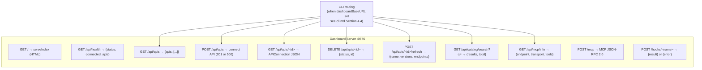

# SPEC-047b — Dashboard HTTP Server

**Status:** Active
**Task:** SPEC-047
**Date:** 2026-07-20
**References:** specs/cli.md (CLI-Dashboard routing), AGENTS.md, README.md
**Module:** `github.com/totalwindupflightsystems/musterflow`
**Package:** `internal/dashboard`

---

## 1. Purpose

The dashboard package (`internal/dashboard`) provides the HTTP server that serves the MusterFlow web UI, the REST API for API connection management, the MCP JSON-RPC endpoint, the catalog search proxy, and webhook triggers for Starlark workflow automation — all on a single port (default `:9876`).

---

## 2. Interface

### 2.1 Server Struct (exact from internal/dashboard/server.go:18-25)

```go
type Server struct {
	registry      *app.Registry
	catalogClient  *catalog.Client
	toolRegistry   *mcp.ToolRegistry
	addr           string
	mux            *http.ServeMux
	mcpHandler     http.Handler
}
```

### 2.2 Constructor and Lifecycle

```go
// NewServer creates a new dashboard server with all routes registered.
// catalogClient and toolRegistry may be nil — routes handle nil gracefully.
func NewServer(registry *app.Registry, catalogClient *catalog.Client, toolRegistry *mcp.ToolRegistry, addr string) *Server

// SetMCPHandler sets the HTTP handler for the /mcp JSON-RPC endpoint.
// If not set, /mcp returns a JSON-RPC error (code -32000) indicating no API is connected.
// Called by main.go after building the MCP handler chain.
func (s *Server) SetMCPHandler(h http.Handler)

// Run starts the HTTP server. Blocks until the server exits.
// Calls http.ListenAndServe(s.addr, s.mux).
func (s *Server) Run() error

// Handler returns the http.Handler (s.mux) for embedding in another server.
// Used by main.go to wrap the dashboard in a custom *http.Server for graceful shutdown.
func (s *Server) Handler() http.Handler
```

### 2.3 Route Registration (internal, called by NewServer)

```go
func (s *Server) registerRoutes()
```

Registers exactly 8 route patterns on `s.mux`:

| # | Pattern | Handler | Methods | Description |
|---|---------|---------|---------|-------------|
| 1 | `/api/health` | `s.handleHealth` | GET | Health check with connected API count |
| 2 | `/api/apis` | `s.handleAPIs` | GET, POST | List all APIs / connect a new API |
| 3 | `/api/apis/` | `s.handleAPIByID` | GET, DELETE, POST | Get/delete/refresh a specific API by ID |
| 4 | `/api/catalog/search` | `s.handleCatalogSearch` | GET | Search community catalog |
| 5 | `/api/mcp/info` | `s.handleMCPInfo` | GET | MCP endpoint info with tool list |
| 6 | `/mcp` | `s.handleMCP` | POST (JSON-RPC) | MCP JSON-RPC 2.0 endpoint |
| 7 | `/hooks/` | `s.handleWebhook` | POST | Webhook trigger for Starlark workflows |
| 8 | `/` | `serveIndex` | GET | Dashboard HTML page |

### 2.4 Handler Function Signatures (all unexported)

```go
func (s *Server) handleHealth(w http.ResponseWriter, r *http.Request)
func (s *Server) handleAPIs(w http.ResponseWriter, r *http.Request)
func (s *Server) handleAPIAdd(w http.ResponseWriter, r *http.Request)
func (s *Server) handleAPIByID(w http.ResponseWriter, r *http.Request)
func (s *Server) handleRefreshAPI(w http.ResponseWriter, r *http.Request, apiID string)
func (s *Server) handleCatalogSearch(w http.ResponseWriter, r *http.Request)
func (s *Server) handleMCPInfo(w http.ResponseWriter, r *http.Request)
func (s *Server) handleMCP(w http.ResponseWriter, r *http.Request)
func (s *Server) handleWebhook(w http.ResponseWriter, r *http.Request)
```

### 2.5 Helper Types and Functions

```go
// mcpToolInfo is the JSON shape returned for each tool in /api/mcp/info.
type mcpToolInfo struct {
	Name        string `json:"name"`
	Description string `json:"description"`
	Example     string `json:"example"`
}

// writeJSON writes a JSON response with the given status code.
func writeJSON(w http.ResponseWriter, code int, data interface{})

// buildToolExample generates a copy-pasteable JSON-RPC tools/call example string.
func buildToolExample(toolName string, inputSchema json.RawMessage) string

// buildExampleArgs extracts property names from a JSON Schema and builds placeholder args.
func buildExampleArgs(inputSchema json.RawMessage) map[string]interface{}

// exampleValueForType returns a placeholder value for a JSON Schema type.
func exampleValueForType(t string) interface{}

// serveIndex serves the dashboard HTML page (handler for "/").
func serveIndex(w http.ResponseWriter, r *http.Request)
```

---

## 3. Data Model

### 3.1 Server Struct

```go
type Server struct {
	registry      *app.Registry      // DuckDB-backed API connection registry
	catalogClient  *catalog.Client     // community catalog HTTP client (may be nil)
	toolRegistry   *mcp.ToolRegistry   // MCP tool registry from connected APIs (may be nil)
	addr           string              // listen address, e.g. ":9876"
	mux            *http.ServeMux       // route multiplexer
	mcpHandler     http.Handler         // MCP JSON-RPC handler (set via SetMCPHandler)
}
```

### 3.2 mcpToolInfo

```go
type mcpToolInfo struct {
	Name        string `json:"name"`
	Description string `json:"description"`
	Example     string `json:"example"`
}
```

### 3.3 POST /api/apis Request Body

```go
// Decoded inline in handleAPIAdd:
var body struct {
	SpecURL  string `json:"spec_url"`
	BaseURL  string `json:"base_url"`
	Name     string `json:"name"`
	AuthType string `json:"auth_type"`
}
```

### 3.4 POST /api/apis Response (201 Created)

```go
map[string]interface{}{
	"id":             result.Connection.ID,        // string
	"name":           result.Connection.Name,      // string
	"spec_title":     result.SpecTitle,             // string
	"spec_version":   result.SpecVersion,           // string
	"endpoint_count": result.EndpointCount,         // int
	"base_url":       result.Connection.BaseURL,    // string
}
```

### 3.5 GET /api/apis/<id>/refresh Response (200 OK)

```go
map[string]interface{}{
	"name":             result.Connection.Name,      // string
	"old_version":      result.OldVersion,            // string
	"new_version":      result.NewVersion,            // string
	"version_changed":  result.VersionChanged,        // bool
	"old_endpoints":    result.OldEndpoints,          // int
	"new_endpoints":    result.NewEndpoints,          // int
}
```

### 3.6 GET /api/mcp/info Response

```go
map[string]interface{}{
	"endpoint":    "http://localhost:9876/mcp",  // string — derived from s.addr
	"transport":    "HTTP JSON-RPC 2.0",          // string
	"tool_count":  len(toolInfos),                 // int
	"tools":       []mcpToolInfo{...},            // array of tool info
}
```

### 3.7 GET /api/catalog/search Response

```go
map[string]interface{}{
	"results": []catalog.CatalogEntry{...},  // array (empty if no query or no results)
	"total":   len(entries),                   // int
}
```

### 3.8 POST /hooks/<name> Response

```go
// Success (200):
map[string]string{"result": output}  // output is the workflow execution result string

// Error (404):
map[string]string{"error": err.Error()}
```

### 3.9 MCP Not-Configured Error Response (from handleMCP when mcpHandler is nil)

```go
map[string]interface{}{
	"jsonrpc": "2.0",
	"id":      nil,
	"error": map[string]interface{}{
		"code":    -32000,
		"message": "MCP server not configured — connect an API first",
	},
}
```

### 3.10 Referenced Types

**catalog.CatalogEntry** (`internal/catalog/client.go:16-28`):

```go
type CatalogEntry struct {
	ID           string    `json:"id"`
	Name         string    `json:"name"`
	Type         string    `json:"type"`           // "api", "workflow", "wasm"
	Description  string    `json:"description"`
	SpecURL      string    `json:"spec_url,omitempty"`
	Author       string    `json:"author"`
	Version      string    `json:"version"`
	Score        int       `json:"score"`           // 0-10
	QualityTier  string    `json:"quality_tier"`   // "official", "community-inferred", "untested"
	AddedAt      time.Time `json:"added_at"`
	Downloads    int       `json:"downloads"`
}
```

**mcp.ToolRegistry** (`internal/mcp/tools.go:23-28`):

```go
type ToolRegistry struct {
	mu          sync.RWMutex
	appRegistry *app.Registry
	tools       []handlers.Tool
	toolConfigs map[string]musterMcp.ExecutionConfig
}
```

---

## 4. Wiring

### 4.1 main.go Integration

`cmd/musterflow/main.go` `startServer()` function wires the dashboard:

1. Resolve port: `config.FindPort(cfg.Port)` (tries port, +1, +2, ... up to 10 ports)
2. `addr := fmt.Sprintf(":%d", port)`
3. Build MCP tool registry: `toolRegistry := mcp.NewToolRegistry(registry)` → `toolRegistry.Refresh()`
4. Create catalog client: `catalogClient := catalog.NewClient()`
5. Create dashboard server: `dashServer := dashboard.NewServer(registry, catalogClient, toolRegistry, addr)`
6. Build MCP handler chain:
   - `handlers.NewRegistry()` — registers 4 handlers: Initialize, Initialized, ListTools, CallTool
   - `mcp.NewHTTPServer(handlerReg)` → returns `http.Handler`
   - `dashServer.SetMCPHandler(mcpHTTPServer)` — wires the /mcp endpoint
7. Wrap in `http.Server{Addr: addr, Handler: dashServer.Handler()}`
8. Start in goroutine: `httpServer.ListenAndServe()`
9. Wait for SIGINT/SIGTERM → `httpServer.Shutdown(ctx)` → `wg.Wait()`

### 4.2 HTTP Route Map



### 4.3 Path Routing Logic (handleAPIByID)

`handleAPIByID` handles the `/api/apis/` prefix. The path after the prefix is parsed:

1. If `path == ""` → 400 Bad Request `{"error": "missing api id"}`
2. If `strings.HasSuffix(path, "/refresh")` AND method is POST → strip suffix, call `handleRefreshAPI(w, r, id)`
3. Otherwise, dispatch by method:
   - GET → `registry.Get(id)` → 200 with connection JSON, or 404 on error
   - DELETE → `registry.Remove(id)` → 200 `{"status": "deleted", "id": id}`, or 404 on error
   - Any other method → 405 Method Not Allowed

### 4.4 MCP Handler Dispatch (handleMCP)

```go
func (s *Server) handleMCP(w http.ResponseWriter, r *http.Request) {
	if s.mcpHandler != nil {
		s.mcpHandler.ServeHTTP(w, r)
		return
	}
	// No handler configured — return JSON-RPC error
	w.Header().Set("Content-Type", "application/json")
	w.WriteHeader(http.StatusOK)  // Note: 200, not 500 — JSON-RPC errors use 200
	_ = json.NewEncoder(w).Encode(map[string]interface{}{
		"jsonrpc": "2.0",
		"id":      nil,
		"error": map[string]interface{}{
			"code":    -32000,
			"message": "MCP server not configured — connect an API first",
		},
	})
}
```

### 4.5 Webhook → Workflow Engine Wiring (handleWebhook)

```go
func (s *Server) handleWebhook(w http.ResponseWriter, r *http.Request) {
	name := r.URL.Path[len("/hooks/"):]  // extract flow name
	if name == "" {
		writeJSON(w, 400, map[string]string{"error": "missing flow name"})
		return
	}
	var payload map[string]interface{}
	if r.Body != nil {
		_ = json.NewDecoder(r.Body).Decode(&payload)  // best-effort, ignore errors
	}
	engine := workflow.NewEngine(
		filepath.Join(app.DefaultDataDir(), "flows"),
		fmt.Sprintf("http://localhost%s", s.addr),  // self-reference for nested API calls
	)
	output, err := engine.Run(name, payload)
	if err != nil {
		writeJSON(w, 404, map[string]string{"error": err.Error()})
		return
	}
	writeJSON(w, 200, map[string]string{"result": output})
}
```

### 4.6 Config Env Vars

No environment variable overrides. Port is from `config.yaml` (`port: 9876`) or `--dashboard-addr` CLI flag. `config.FindPort` auto-discovers an available port in range `[port, port+9]`.

---

## 5. Error Catalog

| Condition | HTTP Route | HTTP Status | Response Body | When it triggers |
|-----------|-----------|-------------|----------------|-----------------|
| Invalid JSON body | `POST /api/apis` | 400 | `{"error": "invalid JSON body"}` | `json.Decode` fails on request body |
| Nil/empty body on POST | `POST /api/apis` | 405 | `{"error": "method not allowed"}` | `r.Body == nil \|\| r.ContentLength == 0` |
| Connect failure | `POST /api/apis` | 500 | `{"error": err.Error()}` | `app.Connect` returns error (spec fetch/parse/registry failure) |
| API not found (GET) | `GET /api/apis/<id>` | 404 | `{"error": err.Error()}` | `registry.Get(id)` returns error (not found) |
| API not found (DELETE) | `DELETE /api/apis/<id>` | 404 | `{"error": err.Error()}` | `registry.Remove(id)` returns error (not found) |
| Missing API ID | `GET /api/apis/` | 400 | `{"error": "missing api id"}` | Path after `/api/apis/` is empty string |
| Method not allowed (by ID) | `PUT /api/apis/<id>` | 405 | `{"error": "method not allowed"}` | Method is not GET, DELETE, or POST+refresh |
| Method not allowed (collection) | `PUT /api/apis` | 405 | `{"error": "method not allowed"}` | Method is not GET or POST |
| Refresh failure | `POST /api/apis/<id>/refresh` | 500 | `{"error": err.Error()}` | `app.Refresh` returns error |
| Catalog search failure | `GET /api/catalog/search` | 500 | `{"error": err.Error()}` | `catalogClient.Search(query)` returns error |
| Missing flow name | `POST /hooks/` | 400 | `{"error": "missing flow name"}` | Path after `/hooks/` is empty |
| Workflow execution failure | `POST /hooks/<name>` | 404 | `{"error": err.Error()}` | `engine.Run(name, payload)` returns error (flow not found, Starlark error) |
| MCP not configured | `POST /mcp` | 200 | JSON-RPC error `{code: -32000, message: "MCP server not configured — connect an API first"}` | `s.mcpHandler == nil` |
| MCP handler error | `POST /mcp` | (delegated) | (delegated to mcpHandler) | `s.mcpHandler != nil` — status and body come from the MCP handler chain |

**Note on JSON-RPC error semantics:** The MCP not-configured response uses HTTP 200, not 4xx/5xx. This is correct JSON-RPC 2.0 behavior — transport-level success with a protocol-level error in the body. The error code `-32000` is in the "Server error" range defined by the JSON-RPC 2.0 spec.

---

## 6. Edge Cases

1. **Nil catalogClient**: `NewServer(registry, nil, toolRegistry, addr)` is valid. `handleCatalogSearch` with a non-empty query calls `s.catalogClient.Search(query)` which will panic on nil. In practice, `main.go` always passes `catalog.NewClient()`, but the server struct allows nil. The existing test `TestServer_CatalogSearch_NoQuery` passes `nil` and tests the empty-query path (which returns early before touching the client).

2. **Nil toolRegistry**: `NewServer(registry, catalogClient, nil, addr)` is valid. `handleMCPInfo` checks `s.toolRegistry == nil` → returns `tool_count: 0` and empty tools array. `handleMCP` checks `s.mcpHandler == nil` (separate field) → returns JSON-RPC error.

3. **Nil registry**: `NewServer(nil, catalogClient, toolRegistry, addr)` will panic on `registry.List()` in `handleHealth`. `main.go` always loads the registry before creating the server. Tests use `app.NewRegistry(t.TempDir())` + `r.Load()`.

4. **Empty catalog query**: `GET /api/catalog/search` (no `?q=` param) → returns `{"results": [], "total": 0}` with 200. Does NOT call the catalog client.

5. **Empty catalog results**: `catalogClient.Search` returns `nil, nil` when the catalog repo returns 404 (catalog doesn't exist yet). The handler converts `nil` to `[]catalog.CatalogEntry{}` before JSON encoding, so the response is `{"results": [], "total": 0}`.

6. **Concurrent API access**: `Registry` uses `sync.RWMutex` — `List()` takes read lock, `Add/Remove` take write lock. Multiple concurrent HTTP requests to `/api/apis` (GET) and `/api/apis/<id>` (POST/DELETE) are safe.

7. **MCP handler set after server start**: `SetMCPHandler` can be called after `NewServer` but the server is already running. Since `handleMCP` reads `s.mcpHandler` without a lock, there is a theoretical race. In practice, `main.go` calls `SetMCPHandler` before `httpServer.ListenAndServe()`. A worker must not add locking to `s.mcpHandler` without an explicit task — the current code is correct for the single-writer-before-start pattern.

8. **Webhook with nil/invalid body**: `handleWebhook` does `_ = json.NewDecoder(r.Body).Decode(&payload)` — errors are silently ignored. `payload` stays `nil` (a valid `map[string]interface{}`). `engine.Run(name, nil)` is called. The workflow engine handles nil payload.

9. **Path traversal in webhook name**: `/hooks/../something` — Go's `http.ServeMux` cleans paths, so `/hooks/../api/health` becomes `/api/health`. No path traversal possible.

10. **Endpoint URL derivation**: `handleMCPInfo` builds the endpoint as `fmt.Sprintf("http://localhost%s/mcp", s.addr)`. If `s.addr` is `:9876`, endpoint is `http://localhost:9876/mcp`. If `s.addr` is `127.0.0.1:9876`, endpoint is `http://localhost127.0.0.1:9876/mcp` (malformed but not a security issue — it's informational only).

11. **Double-slash in API ID**: `/api/apis//refresh` → path after prefix is `/refresh` → `HasSuffix(path, "/refresh")` is true → `id = ""` (TrimSuffix removes the whole string). `handleRefreshAPI` calls `app.Refresh(ctx, registry, "")` → `registry.Get("")` → not found → 500 error.

12. **POST /api/apis with valid body but connect failure**: `app.Connect` can fail at spec fetch, parse, or registry add. All return 500 with the wrapped error message. The CLI's `connectViaDashboard` checks `resp.StatusCode != http.StatusCreated` and surfaces the error.

13. **Large catalog index**: `catalogClient.Search` downloads the entire `index.json` from the catalog repo, decodes it into `[]CatalogEntry`, then filters in-memory with fuzzy search. No pagination. A very large catalog (thousands of entries) is handled but may be slow (10-second HTTP timeout).

14. **ToolRegistry refresh during request**: `handleMCPInfo` calls `s.toolRegistry.ListTools()` which takes a read lock and copies the tools slice. If `Refresh()` is running concurrently (write lock held), `ListTools()` blocks until refresh completes. No stale reads.

---

## 7. Testing

Test file: `internal/dashboard/dashboard_test.go` (563 lines).

Test conventions (from existing tests):
- Registry setup: `r := app.NewRegistry(t.TempDir()); if err := r.Load(); err != nil { t.Fatalf("Load: %v", err) }`
- Server creation: `s := NewServer(r, nil, nil, ":0")` — `nil` for catalogClient and toolRegistry when not needed
- Request: `httptest.NewRequest(method, path, body)`
- Recorder: `httptest.NewRecorder()`
- Dispatch: `s.Handler().ServeHTTP(rec, req)` — uses `Handler()` method, not `Run()`
- Catalog mock: `httptest.NewServer` returning JSON catalog index, `catalog.NewClientWithRepoURL(ts.URL)`
- MCP handler mock: `http.HandlerFunc(func(w, r) { ... })` set via `SetMCPHandler`

### Required Test Scenarios

| Test Name | Setup | Action | Expected |
|-----------|-------|--------|----------|
| `TestServer_HealthEndpoint` | Empty registry, `NewServer(r, nil, nil, ":0")` | `GET /api/health` | 200, body `{"status": "ok"}` |
| `TestServer_HealthEndpoint_ConnectedCount` | Registry with 2 APIs (IDs "a", "b") | `GET /api/health` | 200, `connected_apis` == 2 (float64 from JSON) |
| `TestServer_APIsEndpoint_Empty` | Empty registry | `GET /api/apis` | 200, body has `"apis"` key, value is non-null |
| `TestServer_APIsEndpoint_WithData` | Registry with 1 API (ID="abc123", Name="test-api", ...) | `GET /api/apis` | 200, `apis` is an array of length 1 |
| `TestServer_APIByID_NotFound` | Empty registry | `GET /api/apis/nonexistent` | 404 |
| `TestServer_APIByID_Success` | Registry with API (ID="found-me", Name="found-api", ...) | `GET /api/apis/found-me` | 200, body `{"name": "found-api"}` |
| `TestServer_APIByID_MissingID` | Empty registry | `GET /api/apis/` | 400 |
| `TestServer_APIByID_Delete` | Registry with API (ID="delete-me") | `DELETE /api/apis/delete-me` | 200; subsequent `registry.Get("delete-me")` returns error |
| `TestServer_APIByID_Delete_NotFound` | Empty registry | `DELETE /api/apis/nonexistent` | 404 |
| `TestServer_APIByID_MethodNotAllowed` | Empty registry | `PUT /api/apis/something` | 405 |
| `TestServer_APIs_MethodNotAllowed` | Empty registry | `POST /api/apis` with nil body | 405 (nil body falls through to method-not-allowed) |
| `TestServer_IndexEndpoint` | Empty registry | `GET /` | 200, Content-Type contains `text/html`, non-empty body |
| `TestServer_MCP_NoHandler` | Empty registry, no MCP handler set | `POST /mcp` | 200, body has `error` key with `code` == -32000 |
| `TestServer_MCP_WithHandler` | Empty registry, mock MCP handler set via `SetMCPHandler` | `POST /mcp` | 200, body has `result` key (from mock handler) |
| `TestServer_Handler` | Empty registry | `s.Handler()` | Returns non-nil `http.Handler` |
| `TestServer_CatalogSearch_NoQuery` | Empty registry, nil catalogClient | `GET /api/catalog/search` | 200, `total` == 0 |
| `TestServer_CatalogSearch_WithResults` | httptest catalog server returning `[{id:"stripe",...}]`, `NewServer(r, cc, nil, ":0")` | `GET /api/catalog/search?q=stripe` | 200, `total` >= 1 |
| `TestServer_CatalogSearch_CatalogError` | httptest catalog server returning 500 | `GET /api/catalog/search?q=test` | 500 |
| `TestServer_MCPInfo_NoRegistry` | Empty registry, nil toolRegistry, `NewServer(r, nil, nil, ":9876")` | `GET /api/mcp/info` | 200, `tool_count` == 0, `endpoint` == `"http://localhost:9876/mcp"` |
| `TestServer_MCPInfo_WithTools` | Registry with API, `mcp.NewToolRegistry(r)`, `NewServer(r, nil, tr, ":9876")` | `GET /api/mcp/info` | 200, `endpoint` == `"http://localhost:9876/mcp"`, `transport` == `"HTTP JSON-RPC 2.0"` |
| `TestBuildExampleArgs_Empty` | — | `buildExampleArgs(json.RawMessage{})` | Returns empty map |
| `TestBuildExampleArgs_InvalidJSON` | — | `buildExampleArgs(json.RawMessage("not-json"))` | Returns empty map |
| `TestBuildExampleArgs_StringProperty` | — | `buildExampleArgs` with `{"type":"string"}` property | Returns `{"name": "value"}` |
| `TestBuildExampleArgs_IntegerProperty` | — | `buildExampleArgs` with `{"type":"integer"}` property | Returns `{"count": 1}` |
| `TestBuildExampleArgs_BooleanProperty` | — | `buildExampleArgs` with `{"type":"boolean"}` property | Returns `{"active": false}` |
| `TestExampleValueForType_All` | — | `exampleValueForType` for each type | string→"value", integer/number→1, boolean→false, array→`[]interface{}{}`, object→`map[string]interface{}{}`, unknown→"value" |

### Test for POST /api/apis (connect via dashboard)

| Test Name | Setup | Action | Expected |
|-----------|-------|--------|----------|
| `TestServer_APIs_Post_Connect` | Empty registry, `POST /api/apis` with JSON body `{"spec_url":"https://petstore3.swagger.io/api/v3/openapi.json"}` | POST | 201 with `id`, `name`, `spec_title`, `spec_version`, `endpoint_count`, `base_url` — requires network access to petstore spec |

---

## 8. Hilo Impact

### What depends on this (downstream)

- **cmd/musterflow/main.go** — `startServer()` creates the `Server`, sets the MCP handler, wraps it in `http.Server`, and manages lifecycle (start, signal handling, graceful shutdown).
- **internal/cli** — CLI commands route through the dashboard HTTP API when `dashboardBaseURL` is set (see `specs/cli.md` Section 4.4). The dashboard is the HTTP server that the CLI talks to.
- **internal/mcp** — `mcp.HTTPServer` is set as the dashboard's MCP handler via `SetMCPHandler`. The dashboard delegates `/mcp` requests to it.
- **External MCP clients** — AI agents connect to `http://localhost:9876/mcp` via JSON-RPC 2.0.
- **External webhook callers** — CI/CD systems, GitHub webhooks, etc. POST to `http://localhost:9876/hooks/<flow-name>` to trigger Starlark workflows.
- **Web browser** — the dashboard HTML page at `http://localhost:9876/` is served by `serveIndex`.

### What this depends on (upstream)

- **internal/app** — `Registry`, `APIConnection`, `Connect`, `ConnectOptions`, `ConnectResult`, `Refresh`, `RefreshResult`, `DefaultDataDir`.
- **internal/catalog** — `Client`, `NewClient`, `NewClientWithRepoURL`, `CatalogEntry`, `Search`.
- **internal/mcp** — `ToolRegistry`, `NewToolRegistry`, `ListTools`.
- **internal/workflow** — `NewEngine`, `Engine.Run`.
- **Standard library**: `encoding/json`, `fmt`, `net/http`, `path/filepath`, `strings`.

### Hilo graph position

- `internal/dashboard` is a mid-level package: it consumes `app`, `catalog`, `mcp`, and `workflow`, and is consumed by `cmd/musterflow` and indirectly by `internal/cli` (via HTTP).
- The dashboard is the central orchestration point when running in server mode — it bridges the CLI (via HTTP API), MCP clients (via JSON-RPC), web browsers (via HTML), and webhook callers (via POST).
- In the 43-file, 287-edge, 10-package graph, `internal/dashboard` has moderate fan-in (consumed by main.go) and moderate fan-out (4 internal packages + stdlib).
- The dashboard's `Handler()` method is the single integration point — `main.go` wraps it in a custom `http.Server` for graceful shutdown, rather than calling `Run()` directly.